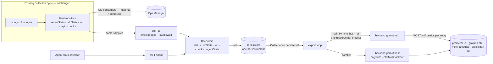
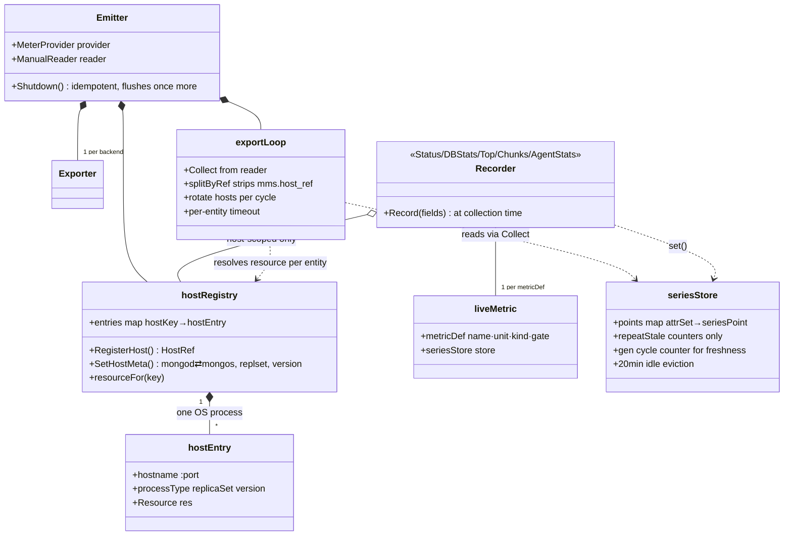

# Demo Plan: OTel Metrics Export from the MongoDB Agent

## Prep (author — before the demo)

- OM + agent build with the OTel path 
  - monitoring enabled
  - 3-member replica set, standalone, sharded cluster.
- `backends.conf` — 
  - `TLS`: `none`/`tls`/`mtls` per backend, 
  - `CERTS`: `shared`/`dedicated` (all backends always deployed).
- `bash quick-start.sh` — validates config, generates certs, writes TLS config, provisions Grafana datasources.
- `bash agent-config.sh` — prints ready `otelConfig` JSON for one/two backends (second slot needs `-otelMultiBackend` agent flag).
- Grafana at <http://localhost:3000> (admin/admin) 
  — dashboards **[MongoDB Agent OTLP Metrics](`http://localhost:3000/d/mongodb-agent-otel-diff)** and **[MongoDB Agent OTLP - Backend Diff](`http://localhost:3000/d/mongodb-agent-otlp-backend-diff')**.
- `catch-request.py` — one-shot raw-request catcher.
- `bash crud-workload.sh` (inserts/updates/deletes across standalone, RS, sharded) to demo load.

### Backend endpoints (agent side):

| Backend | Endpoint for the agent |
| :---- | :---- |
| `prometheus` | `https://localhost:9090/api/v1/otlp/v1/metrics` (mTLS) |
| `grafana-otel` | `https://localhost:4320/v1/metrics` (mTLS) |
| `victoriametrics` | `http://localhost:8428/opentelemetry/v1/metrics` (plain http) |
| `otelcol` (optional fan-out) | `https://localhost:4322/v1/metrics` — point the agent at this one backend to feed all three; never combine with the others in the agent's slots (double ingestion) |

### Agent log locations (this env):

| Stream | File |
| :---- | :---- |
| Monitoring module (`[otel.*]` lines) | `/var/log/mongodb-mms-automation/monitoring-agent.log` (the `logPath` from the automation config) |
| Automation module — errors only | `/tmp/mms-automation1/mms-automation.log` |
| Automation module — full stream | `/tmp/mms-automation1/mms-automation-verbose.log` |

## Live: metrics flowing

### Point the agent at a backend

- `bash agent-config.sh` → apply the printed `otelConfig` (OM UI custom config / API) → wait for module recycle.

### Confirm it's flowing

- Backend Diff dashboard: <http://localhost:3000/goto/s9bcv2?orgId=default>
- Monitoring module log:

  ```shell
  tail -f /var/log/mongodb-mms-automation/monitoring-agent.log | grep --line-buffered "Otel:"
  ```

  → `[otel.info] Otel: emitter initialized: endpoint=http://localhost:8428/… interval=30s compression=gzip`
- Data Already flowing to OM — same collection cycle as before, just an extra sink.

### On the wire — raw view

**Resource attributes**
- Explore raw `victoriametrics` datasource in grafana → `{__name__=~"mongodb.*"}`
  - <http://localhost:3000/goto/spfpcc?orgId=default>
- Every series carries these labels, and can be used for dimensions to group by:
  - `server.address` / `server.port` — the monitored process's host + port (e.g. `M-LDX4WW729M` / `27010`); for agent self-health, the agent's own host
  - `mongodb.process_type` — `mongod` or `mongos`
  - `mongodb.replica_set` — set name (e.g. `myShard_0`); absent for standalone
  - `mongodb.version` — the server's version from buildInfo (e.g. `8.3.9`)
  - `mms_group_id` — the OM project ID
  - The agent's own
    - `service_name=mongodb-agent`, `service_namespace=mongodb.mms` — constants naming the producer
    - `service_instance_id` — deterministic UUID, one per monitored process (derived from its host:port, matching what the mongodbreceiver derives) plus one for the agent itself; stable across restarts
    - `service_version` — the agent's version (e.g. `110.0.0`)

**Name mapping**
- Dots become underscores, counters get `_total` — `mongodb.operation.count` arrives as `mongodb_operation_count_total`. This is the Prometheus OTLP naming convention, applied at ingest by both Prometheus and VictoriaMetrics — not VM-specific.
- Mix: 32 counters, 27 up-down counters, 8 point-in-time gauges, no histograms 
  - counters are cumulative so `rate()` them
  - up-down counters and gauges are current-state values, read directly
  - no histograms means latencies arrive as sums + counts only

**N+1 requests per cycle**

- One request per monitored process plus one agent self-health payload (`mongodb_mms_agent_uptime_seconds`, `…memory.usage`, `…goroutine.count`)
- Catch one request raw:

  ```shell
  docker stop victoriametrics
  python3 catch-request.py > /tmp/otel-req.bin   
  # one-shot: serves one request, dumps it, answers 200, exits
  head -c 900 /tmp/otel-req.bin | cat -v         
  # raw request incl. binary body
  docker start victoriametrics
  ```

  → `POST /opentelemetry/v1/metrics HTTP/1.1` + headers (`Content-Encoding: gzip` when the backend sets gzip, `Content-Type: application/x-protobuf`), chunked framing (chunk size in hex) around the gzip protobuf body, terminating `0` chunk. Server exits after one request — no stale listeners; the agent logs that cycle as `export ok`.

**Per-cycle export log (every 30s)**

- The success line is DEBUG — set the monitoring agent log level to `debug` in OM; applies on module recycle/conf sync, no restart needed. Then:

  ```shell
  grep "export ok" /var/log/mongodb-mms-automation/monitoring-agent.log | tail -5
  ```

  → `Otel: <endpoint>: export ok, attempted 12 resources in XXms` — timestamps 30s apart.
- At the default (info) level only failures show: 
  - `Otel: <endpoint>: export failed for N of M resources` (ERROR), when a backend is down.
  - `export cycle exhausted its 30s budget; N of 12 resources unsent` (WARN) when a backend is slow.

**Replication: per-viewer duplication** (If time allows)

- Explore → `victoriametrics` → raw query: <http://localhost:3000/goto/s5pbvf?orgId=default>
  `{__name__="mongodb_replication_member_state_ratio", mongodb_replica_set="myShard_0"}`
- `replSetGetStatus` is per-mongod: each member reports ALL members of its set from its own point of view. So member B's state is exported three times — as seen by A, by B, and by C. In the table: same `mongodb_member`, different `server_port` (the viewer).
- Plotted raw, every member draws three overlapping lines; the dashboard panel collapses them with `avg by (mongodb_member)` — one line per member. That's why the panel metric is named `..._state_ratio`.
- True for every replica set, not just shards.

### Counter-reset correctness

- Restart one `mongod` from OM (automation recycles the process) and watch the Backend Diff dashboard.
- `mongodb.uptime` / `mongodb.operation.count` drop, a new counter start time derived from the new `mongod` uptime, and cumulative semantics preserved — `rate()` stays correct. A restart is a standard counter reset, not data loss.

### The tee

- OM ingestion is untouched — both paths run off the **same collected samples**.

## How this differs from Prometheus and OM metrics

- Collection is identical — `serverStatus`, `dbStats`, `top`, repl/oplog, sharding metadata, the agent's existing cycle. No new collection, no load on mongod; it's a tee off the samples.
- vs OM: OM ingests its own internal metric identifiers; OTel emits the OpenTelemetry data model — `mongodb.*` semantic names, explicit instrument types, UCUM units, resource-attribute dimensions instead of OM's labeling. A signal is delivered on both paths by design.
- vs Prometheus: they pull (scrape `/metrics`), we push (OTLP/HTTP on a timer). Names differ too — `mongodb_op_counters_total` vs `mongodb.operation.count` — so dashboards and alerts are built against the OTel metric contract, not ported with find-and-replace.

## Resilience war stories

Theme: **failures on the OTel path are contained; OM delivery never blinks.**

### Kill the backend

```shell
docker stop victoriametrics
# monitoring module log — export errors land here:
tail -f /var/log/mongodb-mms-automation/monitoring-agent.log | grep --line-buffered "Otel:"
```

- Per-entity export errors each cycle — `Otel: <endpoint>: export failed for N of M resources`; nothing crashes. OM UI: ingestion unaffected.
- Counter series keep being re-exported unchanged while the process is unreachable — a collection gap is never misread as a reset.
- Point-in-time gauges (`mongodb.health`) repeat once — heals a single failed export — then go silent. An unreachable mongod doesn't keep reporting `health=1`.
- Series lifetime: no new sample for 20 minutes → the series is dropped and disappears from the backend. Alerts must account for missing-data behavior. (mention — don't wait)
- `docker start victoriametrics` → export resumes next cycle, no action needed.

### Failing backend doesn't starve the other *(note — only with `--otelMultiBackend`)*

- Backends export concurrently from a single collection, each entity under its own timeout; a slow/failing backend is dropped from its cycle while the other completes.

### Not demoed — mention in passing

- **No host starvation:** an export cycle that exhausts its budget (90% of the interval) skips the remaining entities with a warning and re-sends next cycle; host order **rotates every cycle** (agent self-health always first) — no host starved forever.
- **Panic containment:** a panic in one export cycle or one backend is recovered and logged; next cycle proceeds.
- **Shutdown flush:** final flush on shutdown with a deadline of one full export interval — no lost samples; not realistically observable live.

## Fail-loud configuration + TLS + endpoint defaults

### Bad config → restart → recovery

- A misconfigured `otelConfig` fails loudly: the monitoring module refuses to start — this affects monitoring as a whole — retries every 30s, and surfaces to OM as error code **129** (`OtelStartErr`). OM reporting itself continues.

  ```shell
  # mms-automation.log carries errors only, so tail both (verified: retries 30s apart; recovered is INFO -> verbose log)
  tail -f /tmp/mms-automation1/mms-automation.log /tmp/mms-automation1/mms-automation-verbose.log \
    | grep --line-buffered -e "Otel:" -e "OTel startup"
  ```

  ```
  Error starting Monitoring module : backend 1: Otel: invalid compression "asd" …
  OTel startup failure. keeping deployment in publishing state
  OTel startup recovered. resuming normal goal-state reporting      <- after fixing with bash agent-config.sh
  ```

**Rejection payloads — demo these three:**

| Scenario | Payload (the `otelConfig` value) | Error shown |
| :---- | :---- | :---- |
| Missing scheme | `{"enabled":true,"backends":[{"endpoint":"collector:4318"}]}` | `a scheme is required, e.g. https://… to encrypt or http://… for a local collector` |
| Two backends, no flag | `{"enabled":true,"backends":[{"endpoint":"https://collector1:4318"},{"endpoint":"http://collector2:4318"}]}` | `at most 1 are supported` |
| Interval < 30 | `{"enabled":true,"metricsExportIntervalSec":15,"backends":[{"endpoint":"https://collector1:4318"}]}` | `metricsExportIntervalSec must be at least 30, got 15` (same for `0`, `-5`) |

**Same fail-loud flow, different message — mention after demoing one per group:**

- Endpoint URL rejections: bad scheme (`ftp://collector:4318` → `invalid endpoint scheme`) · missing host (`http://` → `missing host`) · userinfo (`https://user:pw@collector:4318` → `credentials in the URL are not sent. Please put them in headers` — the password never appears in the error) · query string (`…/v1/metrics?tenant=x` → `a query string is not sent`) · missing endpoint (`{"enabled":true,"backends":[{}]}` → `endpoint is not set`).
- Structural rejections: no backends (`{"enabled":true,"backends":[]}` → `enabled=true but backends is empty`) · invalid JSON (`{not json}` → `parsing otelConfig`).
- Field-level rejections: unknown compression (`"compression":"zstd"` → `invalid compression "zstd"`) · malformed headers (`"headers":"no-equals-sign"` → `invalid headers entry`) · empty header key (`"headers":"=Bearer token"` → `invalid headers entry`).

### Endpoint defaults

- Packaged receivers all use explicit ports and paths (prep table) — defaults are shown by catching the raw request; no real 4318 receiver needed.
- Apply `{"enabled":true,"backends":[{"endpoint":"http://localhost"}]}` (no port, no path), then:

  ```shell
  python3 catch-request.py 4318 > /tmp/otel-req.bin   # same one-shot server as in "On the wire — raw view"
  head -c 900 /tmp/otel-req.bin | cat -v              # POST /v1/metrics HTTP/1.1, Host: localhost:4318
  ```

- Custom path is honored as-is: `http://localhost:4318/custom/metrics` → `POST /custom/metrics`.

### TLS use cases

Setup: TLS mode in `backends.conf`, applied by `bash quick-start.sh`. Certs in `certs/`: `ca.crt` = `caCertPath`, `client.crt`/`client.key` = `clientCertPath`/`clientKeyPath`. `bash agent-config.sh` emits the matching config for the active mode.

**Run live (in order):**

| # | `backends.conf` setup | `otelConfig` backend fields (as printed by `agent-config.sh`) | Expected result |
| :---- | :---- | :---- | :---- |
| 1. Self-signed CA pinned | `TLS=tls` for the backend, `bash quick-start.sh` | `"endpoint":"https://…","caCertPath":"…/certs/ca.crt"` | Export succeeds. |
| 2. mTLS | `TLS=mtls`, re-run `bash quick-start.sh` | Same + `"clientCertPath":"…/certs/client.crt","clientKeyPath":"…/certs/client.key"` | Export succeeds. |
| 3. Encrypted client key | Same as case 2 | Encrypt once: `openssl rsa -aes256 -in certs/client.key -out certs/client.key.enc -passout pass:otel-demo`, then case 2 fields with `client.key.enc` + `"clientKeyPassword":"otel-demo"` | Export succeeds. |
| 4. Scheme decides TLS | Plain-http backend (`victoriametrics` on 8428) | `"endpoint":"https://localhost:8428/…"` vs `"endpoint":"http://localhost:8428/…"` | `https://` fails against the plaintext listener; `http://` works. No guardrail prevents `http://` in production — prefer `https://`. |

**Expected-failure variants — after the matching success case:**

- After 1 — stale/wrong `caCertPath` (or dropped): module starts (endpoint is runtime-reachable), but every cycle logs a cert-verification export error (`certificate is valid for …, not <hostname>` when the SAN is missing); OM unaffected. Fixing `caCertPath` recovers.
- After 2 — drop `clientCertPath`/`clientKeyPath`: TLS handshake failure logged each cycle; OM unaffected.
- After 3 — wrong `"clientKeyPassword":"wrong"`: **startup** failure (key decryption happens at config time): module refuses to start, error 129, retries every 30s.

(TLS floor is 1.2 — mention, don't demo.)

## Architecture recap

Two views of the same thing: the flow (what runs, where things get parallel and isolated) and the storage (what lives where inside the emitter).



- Everything right of the tee is additive and best-effort; the OM arm never depends on it.
- Parallelism: one goroutine per backend, and within a backend, per-entity timeouts — a slow destination only costs its own cycle.
- Config parsing happens once at module start (`executor.go:122`); a bad config kills the module (see *Fail-loud configuration*) rather than shipping garbage.



- `metricDef` tables are the single source of truth for every metric — name, unit, kind, gate. Three naming groups: receiver-aligned `mongodb.*`, OM-only extras also under `mongodb.*`, agent self-health under `mongodb.mms.*`.
- `hostRegistry` gives every process its own resource by construction; `mms.host_ref` is an internal routing key — stripped before anything hits the wire.
- `seriesStore` implements the staleness semantics shown under *Resilience war stories* — counters repeat, gauges heal once then go silent, 20-min eviction — using generation counters, not wall clocks.

## Wrap-up: how this was validated

- **E2E (automated):** Datadog backend via `datadogreceiver` — header-based auth over HTTP, delta-metric handling.
- **Manual:** this `otel-receiver` package — exactly the infrastructure demoed today (three receivers + collector fan-out, TLS/mTLS via `backends.conf`).
- **Ground-truth tooling (this package):**
  - `python3 compare-otel-appdb.py --port 27001` — side-by-side diff of OTLP samples vs OM appDB pings for the same collection cycle (TestPlan 3.2).
  - `python3 check-monitored-hosts.py` — coverage matrix: every monitored process fresh on both OM and OTLP paths.
- `~/Repos/mms-automation/Docs/TestPlan.md` — scenarios; conventions like the global "OM ping is never affected" invariant and the N+1 per-host export rule. Recorded outcomes in `~/Repos/mms-automation/Docs/TestPlanResults.md`.
